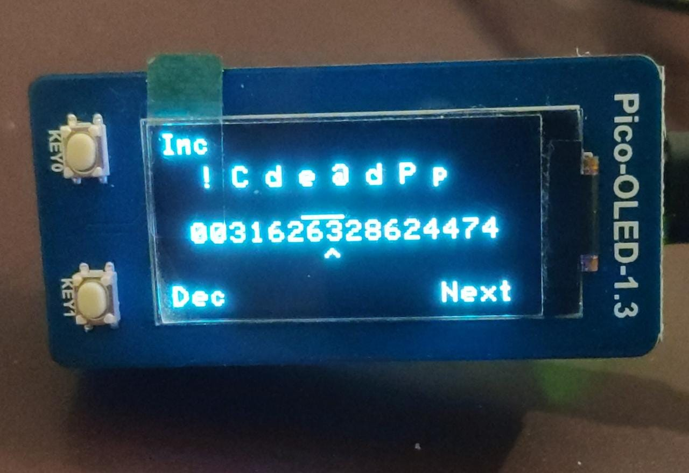

# Raspberry Pi Pico/MicroPython 2FA TOTP Generator

Generates Time-based One-Time Password's (TOTP) using MicroPython, Raspberry Pi Pico W and the [Waveshare Pico-Oled-1.3](https://www.waveshare.com/product/pico-oled-1.3.htm).


## Features

- Complete [MicroPython implementation](totp) of the TOTP specification (and underlying HMAC-SHA1, Base32 dependencies).
- Countdown timer to present how long till the TOTP is about to expire.
- Encrypt OTP code data with user password.
- Use WiFi network and NTP to set the current UTC time - to correct the Raspberry Pi Pico W's RTC.
- Reinvent old functionality for datetime input 3 buttons instead of 4, as fallback if no WiFi available. (Note 1 below)
- Encrypt Wifi data with user password too


## Usage

- Connect the display to the Raspberry Pi Pico W.
- Create a `codes.json` file (based on `codes.json.example`) which includes the desired TOTP keys.
- Create a `WifiSecrets.json` file (based on `WifiSecrets.json.example`) which includes the common wifi SSIDs + passphrases available.
- Flash the Pico W with the latest [MicroPython](https://micropython.org/download/rp2-pico-w/).
- Copy the codebase except `main.py` to the Raspberry Pi Pico W.
- Open an interactive session on the Pico and encrypt the `codes.json` and `WifiSecrets.json` as below:
```
>>> import cryptor
>>> key='your8chr'
>>> cryptor.encrypt('codes.json',key)
>>> cryptor.encrypt('WifiSecrets.json',key)
```
- Remove the unencrypted `WifiSecrets.json` and `codes.json` from the Pico W storage
- Copy main.py to the Pico
- Reset the Pico W
- Enter your password at the initial password prompt.
  - Key0 increments current selection
  - Key1 decrements current selection
  - Bootsel button steps to next selectable item.
- Fix datetime at Date time prompt if Wifi doesn't work.
- Now you can cycle through your TOTP's using Key0 of the Pico-Oled-1.3.
- Key1 of the Pico-Oled-1.3 toggles the display ON/OFF.


## Password length, range and security

The secrets are encrypted using a simple scheme using an 8 character password. However valid characters are any ASCII
character with *the following exceptions*:
- Space and non-blocking space
- Quotes: `"`, `'`,`` ` `` (including backquote/backtick)
- backslash - `\`,
- Hyphen: `-`

The password is taken as a 8 pairs of 2 digits, each pair representing the ordinal of a character of the password. Each digit takes
a seperate input, leading to quicker input with just increment/decrement keys (worst case is 12 keypresses per characters encoded as
numbers, as compared to 46 with incrementing characters)



The SHA256 digest of this key is generated and used as the encryption key for the secret files.

There are 89 valid characters (128 - 32 - 2 - 5) and so 89^8 possible passwords, so it's around a day's worth of effort to crack this scheme.

However, additional security can be achieved by taking another number as input, and then running those many rounds of hashing on the hash results to generate the final hashed key.

But that's future work for the paranoid forker.

## Updating secrets

- Connect to the REPL
- Press CTRL-C to stop the code and bring up the prompt
- Run the following code to dump the secrets files to console as plain text:
```
>>> import cryptor
>>> key='your8chr'
>>> print(cryptor.decrypt('codes.json.encoded',key).decode())
>>> print(cryptor.decrypt('WifiSecrets.json.encoded',key).decode())
```
- Copy the outputs into `codes.json` and `WifiSecrets.json` on your workstation, and update with new secrets as required.
- Push the updated `codes.json` and `WifiSecrets.json` to the Pico W.
- Encrypt `codes.json` and `WifiSecrets.json` and overwrite previous encoded files as below:
```
>>> import cryptor
>>> key='your8chr'
>>> cryptor.encrypt('codes.json',key)
>>> cryptor.encrypt('WifiSecrets.json',key)
```
- Remove the unencrypted `WifiSecrets.json` and `codes.json` from the Pico W storage.

## Migrating from Google Authenticator

Requirements:
  - Workstation with git, python, internet
  - Source device
  - QR code scanner device

- Export authenticator codes (this is done by the authenticator app as encoded strings further encoded as QR codes.
- Scan the QR code to get the encoded strings (may be multiple sets, depending on the number of codes to migrate)
- checkout https://github.com/brookst/otpauth\_migrate.git
- Follow instructions there and run on the encoded strings to get decoded TOTP codes
- Fill into codes.json and follow the process as previously mentioned.

## Acknowledgements

Forked from [Kleo's](https://github.com/kleo) [fork](https://github.com/kleo/pico-2fa-totp) of the [pico-2fa-totp](https://github.com/eddmann/pico-2fa-totp) created by [Edd Mann](https://github.com/eddmann).

Pico-oled-1.3 driver by [Waveshare](https://www.waveshare.com/wiki/Pico-OLED-1.3#Examples) updated with [nicer fonts](https://github.com/markwinap/Pycom-SH1107-I2C/blob/master/lib/SH1107.py).
